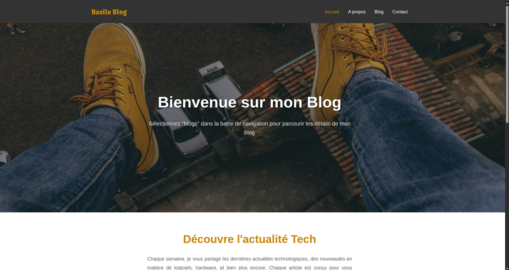
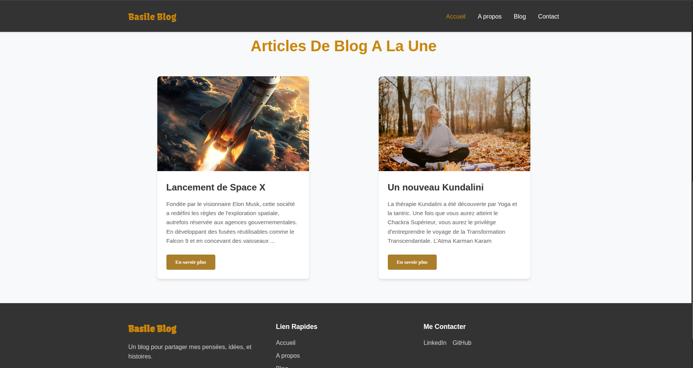
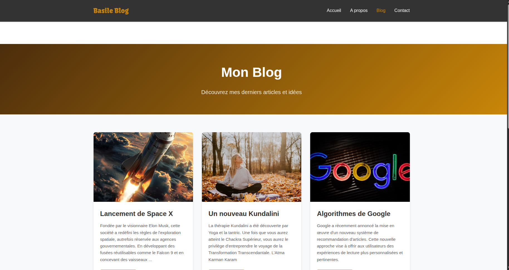
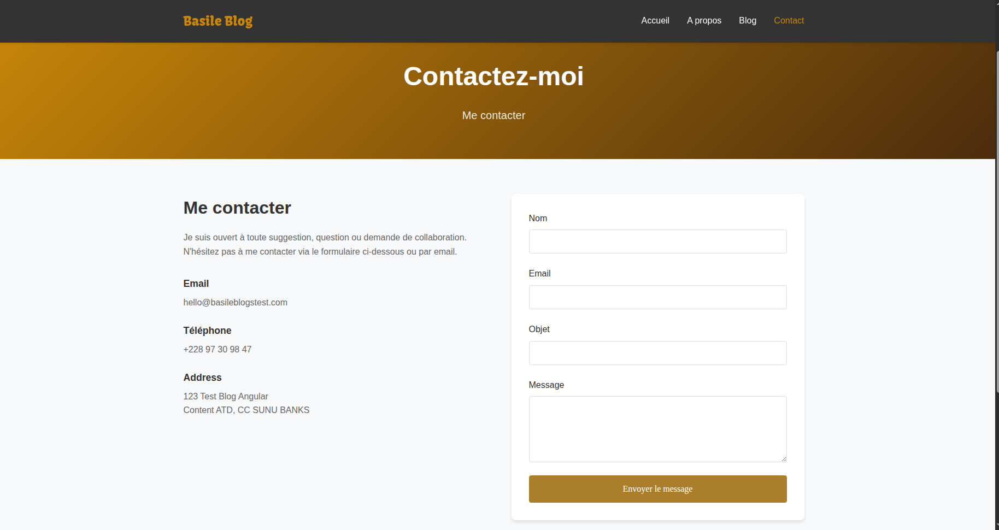

# 📝 Blog

Bienvenue sur mon premier projet personnel en **Angular** !  

Il s'agit d'un site de blog créé pour tester et améliorer mes compétences en Angular.

Pour voir le site en ligne, cliquez sur le lien Vercel : [Voir le site](https://blog-three-gray-clciveec10.vercel.app/)  

---

## 🌄 Aperçu du projet

Voici quelques captures d'écran du site :

 

 

 


---

## 🚀 Fonctionnalités

### Frontend (Angular)
- Créé avec **Angular**
- Navigation simple et intuitive
- Pages de blog dynamiques
- Interface responsive

### Backend (NestJS)
- API REST avec **NestJS**
- Gestion des Reception de messages
- Structure modulaire et extensible
- Préparé pour connexion future à une base de données
---

## ⚙️ Installation et lancement

### 1. Cloner le dépôt
```bash
git clone <https://github.com/basileatsougan/blog>
cd blog

### 2. Lancer le frontend (Angular)
cd frontend
npm install
ng serve

➡️ Accéder à http://localhost:4200

### 3. Lancer le backend (NestJS)
```bash
cd backend
npm install
npm run start:dev

➡️ API disponible sur http://localhost:3000
---

## 🛠️ Technologies utilisées

Frontend : Angular, TypeScript, HTML, SCSS

Backend : NestJS, TypeScript, Node.js

Autres : Git, VSCode