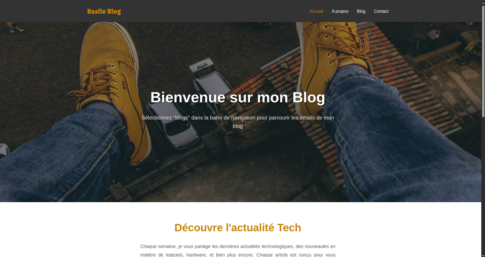
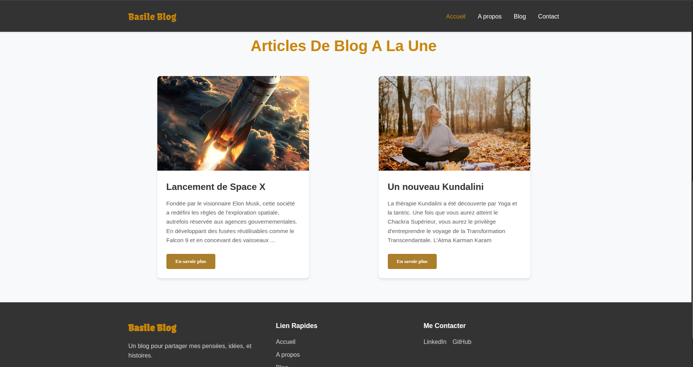
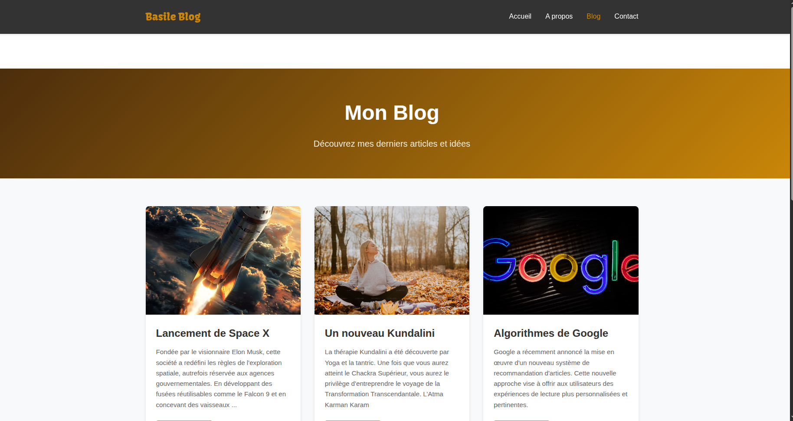

# 📝 Blog

Bienvenue sur mon premier projet personnel en **Angular** !  

Il s'agit d'un site de blog créé pour tester et améliorer mes compétences en Angular.

Pour voir le site en ligne, cliquez sur le lien Vercel : [Voir le site](https://blog-three-gray-clciveec10.vercel.app/)  

---

## 🌄 Aperçu du projet

Voici quelques captures d'écran du site :

| Accueil | Page Article | Page Blog |
|---------|--------------|-----------|
|  |  |  |

---

## 🚀 Fonctionnalités

- Créé avec **Angular**
- Navigation simple et intuitive
- Pages de blog dynamiques
- Interface responsive

---

## 📂 Installation

Si vous voulez tester le projet en local :  

```bash
# Cloner le dépôt
git clone <https://github.com/basileatsougan/blog>

# Installer les dépendances
npm install

# Lancer le serveur
ng serve
